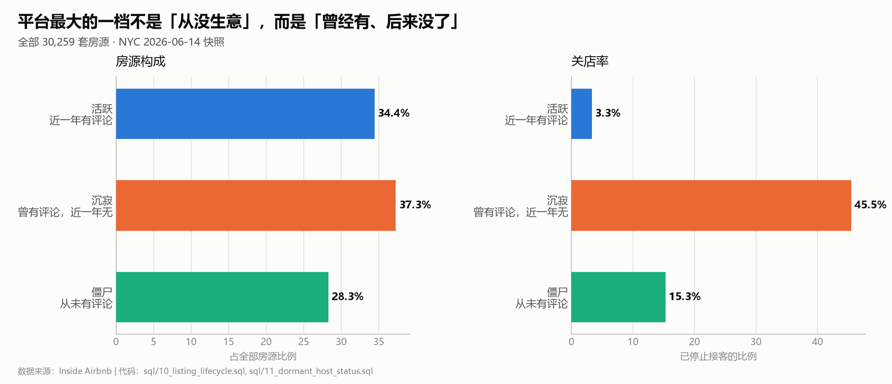
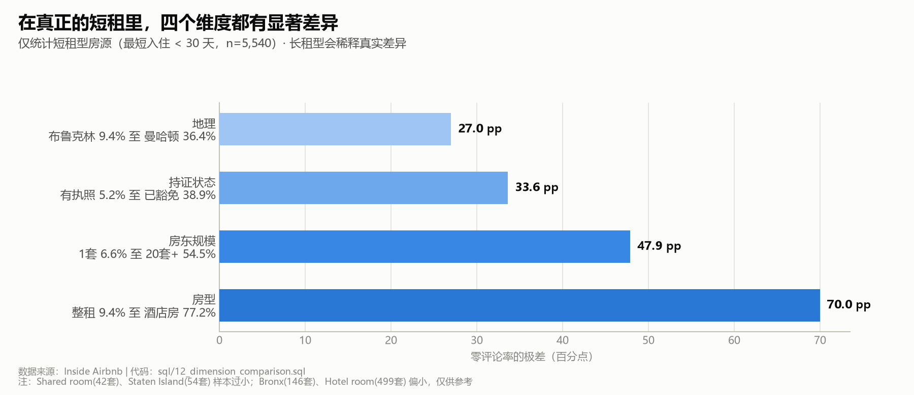
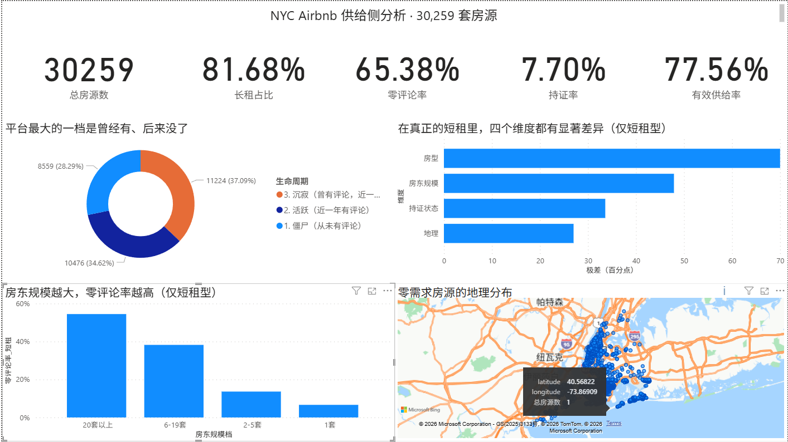

# NYC Airbnb 供给侧分析

> 从 30,259 套房源、99 万条评论中，拆解一个共享短租平台的**有效供给**究竟有多少。
>
> **一句话结论：平台最大的问题不是「房源不够」，而是挂着的房源大半不在做短租生意。**



*平台最大的一档不是「从没生意」，而是「曾经有、后来没了」*

---

## 📌 三个核心发现

### 1️⃣ 平台上 81.7% 的「房源」根本不是短租

24,717 套房源的最短入住要求在 30 天以上 —— 其中 **94.9% 精确卡在「30 天」这个数字上**。
这不是自然分布，而是纽约 Local Law 18 的登记门槛（30 天以下需登记）。

**真正的短租只有 5,542 套（18.3%），而且经营状况良好：72.4% 有成交。**

追问这 23,698 套「30 天起租」的房源：**76.6% 完全没有收入** ——
它们不是真正的长租，而是挂在平台上、绕开监管、不产生任何交易的房源。

### 2️⃣ 「零需求」里，流失比从未激活更多

| 生命周期 | 房源数 | 占比 |
|---------|-------|------|
| 活跃（近一年有评论） | 10,476 | 34.6% |
| **沉寂（曾有评论，近一年无）** | **11,224** | **37.1%** |
| 僵尸（从未有评论） | 8,559 | 28.3% |

**「曾经做成过生意、后来没了」的房源，比「从来没做过生意」的还多。**

### 3️⃣ 沉寂房源中近一半的房东已真实退出

```
活跃房源   3.2%  关店   ▏
僵尸房源  15.3%  关店   ▎▎
沉寂房源  45.8%  关店   ██████████████   ← 断崖
```

**5,138 套房源的房东已停止接客。** 他们曾经证明过自己能做生意，是最可能被挽回的一批。

---

## 🔬 分析过程：三次自我修正

这个项目最有分量的部分不是结论，而是**结论被推翻和修正的过程**。

### 修正一 · 公式方向

流传较广的出租率估算公式写作「订单数 = 评论数 × 0.5」。
用业务逻辑验算：若 50% 的客人写评论，则 `订单数 = 评论数 ÷ 0.5 = 评论数 × 2`。
按 ×0.5 会得出「订单数少于评论数」的荒谬结论。

**→ 文献里也有错。任何继承来的公式都要独立验算一遍。**

### 修正二 · 成分假象

初版分析：无证房源零评论率 73.9%，有证房源 6.6%，**差 67.3 个百分点**。

但持证房源 97.4% 是短租型，无证房源 98.5% 是长租型 —— 两者几乎完全绑定。
**初版比较实际是把两种不同的商品混在一起比。** 分层后差异缩小到 24.4 pp。

### 修正三 · 稀释效应（最重要）

把四个维度统一在【短租型内部】重算后，结论全部改变：

| 维度 | 全部房源（旧） | **短租型内部（修正后）** | 变化 |
|------|--------------|---------------------|------|
| 房型 | 1.3 pp「无差异」 | **70.0 pp** | ×54 |
| 房东规模 | 18.3 pp（U 型） | **47.9 pp（单调递增）** | ×2.6 |
| 持证状态 | 24.4 pp | **33.6 pp** | ×1.4 |
| 地理 | 5.3 pp「无差异」 | **27.0 pp** | ×5 |

**机制**：短租型仅占全部房源的 19%，其内部的 27 pp 差异传到全样本时被压缩成 5 pp。

> 长租型的零评论率（74.5%）在各维度上高度一致，**像一层均匀的底噪，把真实信号盖住了**。
>
> **教训：混算两个不同人群，不只是让数字不准，而是会让真实差异消失 ——
> 你会得出「没有差异」这种看上去很安全的错结论。**



*仅统计短租型房源（n=5,540）—— 长租型会稀释真实差异*

---

## 📊 地理分布

**🗺️ [点击查看街区级交互地图](visualizations/04_map.html)**
（HTML 交互文件，GitHub 上需下载后本地打开）

街区级（132 个样本充足的）零评论率从 **20.4% 到 93.9%**，极差 **73.5 pp** ——
是行政区级（5.3 pp）的 **14 倍**。

```
Battery Park City   93.9% 零评论   长租占比 93.9%   ← 大型住宅社区
Fort Hamilton       20.4% 零评论   长租占比 25.8%
```

零评论率与长租占比相关系数 **r = 0.470**（中等偏强，仅解释 22% 的差异）。

---

## 📈 Power BI 交互看板



*一页看板：5 个 KPI + 生命周期构成 + 四维度对比 + 房东规模趋势 + 街区地图*

**连接方式**：直连 MySQL（非导入 CSV），度量值用 DAX 编写。
PDF 版见 [`reports/airbnb_nyc_dashboard.pdf`](reports/airbnb_nyc_dashboard.pdf)。

---

## 💡 业务建议

每条建议回答五个问题：**对谁做 / 凭什么判断 / 做什么 / 值多少钱 / 怎么验证**。

### 建议 1 · 分层调研已退出的房源 ⭐ 先做这个

```
对象     5,138 套房源 · 涉及 4,429 个房东（占平台 17.0%）
依据     曾产生 103,896 条历史评论（≈ 20.8 万笔历史订单）—— 真正做成过生意
```

**⚠️ 第一步不是外呼，是抽样调研。**

因为数据里**无法区分退出原因**：「成功转长租」（不该打扰）vs「放弃经营」（要挽回）。

```
动作  抽 200 套分层调研 → 问三个问题（为什么关 / 还会回来吗 / 什么条件会回来）
      → 按回答分成「可挽回 / 不可挽回 / 需干预」→ 只对可挽回的做动作
成本  调研 200 套 ≈ 7 人天；若全量外呼 ≈ 148 人天（约 7 人月）
回报  机会上限 $113M/年；挽回 10% ≈ $11.3M/年
验证  「可挽回」占比 · 挽回后 90 天留存率 ≥ 70%
```

**为什么先做这个**：第一步成本极低（7 人天），但能消除整个决策中最大的不确定性。

### 建议 2 · 超级房东客户管理

```
对象  93 个房东 / 6,522 套房源（21.6%）；Top 10 占 3,023 套（10.0%）
依据  供给高度集中 = 单点风险。Top 10 集体退出，平台立刻损失 10% 供给
动作  建档 · 季度沟通 · 异常监控（可订天数骤降、批量下架）
验证  Top 20 房东季度房源存活率 ≥ 95%
```

### 建议 3 · 长租型与短租分离展示

```
对象  24,717 套长租型，其中 18,974 套（62.7%）零收入
依据  62.7% 的房源占着展示位不产生 GMV；用户搜"住3天"却看到"30天起租"
动作  产品分频道 · 搜索可排除 · 房东侧明确告知后果
验证  短租房源搜索曝光占比 · 用户转化率
```

### 建议 4 · 差异化运营：识别高绩效组合

```
短租型内的表现差距可达 20 倍：
    整租 + 有执照      2.3% 零评论率   （514 套）  ← 最好
    独立间 + 已豁免   48.1%           （1,242 套）  ← 最差
动作  高绩效组提炼标杆；低绩效组（1,242 套）抽样诊断原因
```

> ⚠️ **因果提示**：持证与经营表现**相关但非因果** —— 更可能是"认真经营的房东才会去办证"。
> 所以动作是**诊断**，不是"劝房东办证"。

---

## 🌍 外部基准对照

本分析的发现得到独立数据印证：

| 本分析 | 外部基准 | 来源 |
|--------|---------|------|
| 81.7% 房源为 30 天起租 | ~70.1%（2025-04 分析） | 行业分析 |
| 有执照房源 2,330 套 | Local Law 18 后合法短租约 3,000 套 | 法规影响评估 |
| 短租型 72.4% 有成交 | NYC 出租率 66%~71%（全国 54%） | AirDNA / Airbtics / PriceLabs |

**→ 这不是数据怪象，而是 Local Law 18 实施后的真实行业结构变化。**

---

## 🛠 技术栈

```
MySQL 8          多表 Join · 窗口函数 · 13 个分析查询
Python / Pandas  数据体检 · 口径验证 · 清洗 · 特征
Matplotlib       静态图表
Folium           街区级交互地图
Power BI         交互式看板（设计稿见 docs/）
```

---

## 🔍 分析查询一览（`sql/`）

**13 个查询，按分析顺序编号 —— 每个文件 = 一个业务问题。**
每个文件开头都写明「业务问题 / 口径说明 / 结论」，可以直接当分析日志读。

### 数据体检

| 文件 | 做什么 |
|------|--------|
| `08_multitable_health_check.sql` | Join 前的外键完整性检查 —— 发现 0.97% 孤儿记录 |

### 供给总览

| 文件 | 结论 |
|------|------|
| `00_supply_overview.sql` | 四象限分类，发现 44.1% 房源「开门但没客」 |

### 第一轮排查：零需求是哪个维度造成的？

| 文件 | 维度 | 初版结论 | 修正后（见 `12`） |
|------|------|---------|-----------------|
| `01_zero_review_by_area.sql` | 地理 | 5.3 pp「无差异」 | **27.0 pp** |
| `02_zero_review_by_room_type.sql` | 房型 | 1.3 pp「无差异」 | **70.0 pp** |
| `03_zero_review_by_host_type.sql` | 房东规模 | U 型 | **单调递增** |
| `05_zero_review_by_license.sql` | 持证状态 | 67.3 pp | **33.6 pp** |
| `04_mega_hosts_detail.sql` | 超级房东 | 0.56% 房东控制 21.6% 房源 | — |

### 结构性发现

| 文件 | 结论 |
|------|------|
| `06_minimum_nights_structure.sql` | **81.7% 的「房源」是 30 天起租的长租型** |
| `07_license_stratified.sql` | 持证效应的分层检验 —— 67.3 pp 大部分是成分假象 |

### 生命周期与房东行为

| 文件 | 结论 |
|------|------|
| `09_review_timeline.sql` | Join `reviews` 表求每个房源的最后评论日（多表关联演示） |
| `10_listing_lifecycle.sql` | 三档分类：僵尸 8,559 / 沉寂 11,224 / 活跃 10,476 |
| `11_dormant_host_status.sql` | **沉寂房源 45.8% 已关店（5,138 套房东已退出）** |

### 口径统一

| 文件 | 结论 |
|------|------|
| `12_dimension_comparison.sql` | 统一在短租型内部重算四个维度 → **推翻 4 条旧结论** |

---

## 📁 项目结构

```
airbnb-nyc-supply-analysis/
├── README.md
├── requirements.txt
├── config.example.py       数据库配置模板
├── sql/                    13 个分析查询（00~12），每个 = 一个业务问题
├── scripts/                数据体检 / 口径验证 / 清洗 / 入库 / 绘图
├── docs/
│   ├── 数据字典.md          字段含义 + 7 个数据陷阱
│   ├── 指标体系.md          北极星 GMV + 因子拆解 + 维度拆解
│   ├── 方法论_出租率估算.md  出租率反推方法与敏感性分析
│   └── insights_collection.md  37 条发现（每条附代码位置）
├── reports/
│   ├── analysis_report.md   完整分析报告（8 章）
│   └── airbnb_nyc_dashboard.pdf  Power BI 看板导出
├── visualizations/         4 张图表 + Power BI 截图
└── data/                   原始数据（不入库）
```

---

## 🔁 复现方式

```bash
# 1. 下载数据（Inside Airbnb NYC 2026-06-14 快照）
#    需要 listings / calendar / reviews / neighbourhoods.geojson 四个文件
#    放入 data/raw/

# 2. 安装依赖
pip install -r requirements.txt

# 3. 配置数据库
cp config.example.py config.py    # 填入你的 MySQL 密码

# 4. 按顺序执行
python scripts/00_check_schema.py      # 数据体检
python scripts/01_verify_metrics.py    # 口径验证
python scripts/02_clean_listings.py    # 清洗
python scripts/03_import_to_mysql.py   # 入库（11M 行，需几分钟）
python scripts/04_make_charts.py       # 出图

# 5. 跑任意分析查询
python scripts/run_sql.py sql/10_listing_lifecycle.sql
```

---

## ⚠️ 局限说明

- **出租率为估算值**：平台不公开订单数据，本分析使用评论数反推。已实测确认
  `estimated_occupancy_l365d` 与 `number_of_reviews_ltm` **完全等价**（两者为 0 的行 100% 重合）。
  **「零评论」不等于「零订单」** —— 按 50% 评论率，1 笔订单有 50% 概率零评论。故表述为「需求极低」。
- **快照非单一时点**：采集期 2026-06-14 至 06-23，涉及时间的指标存在最多 9 天漂移。
- **Join 损失约 1%**：约 0.97% 的 calendar / reviews 记录在 listings 中无对应房源。
- **口径统一说明**：生命周期三档统一采用平台官方字段（`number_of_reviews` / `_ltm`）。
  此前曾用 Join `reviews` 表自算 365 天窗口，结果与官方口径相差 **57 套（0.19%）** ——
  因两种「近一年」的边界定义不同。**现已全部统一为官方口径**，
  保证本报告、matplotlib 图表与 Power BI 看板三处数字完全一致。
- **小样本分组**：Shared room（42 套）、Staten Island（54 套）样本过小，结论仅供参考。
- **因果不可反推**：持证与经营状况相关，但持证不是原因，而是「房东在认真做生意」的标记。

---

## 📄 数据来源

[Inside Airbnb](https://insideairbnb.com/) —— 非营利短期租赁开放数据项目。
数据仅用于研究与非商业分析。

*快照：NYC 2026-06-14 至 2026-06-23 · 30,259 套房源*
